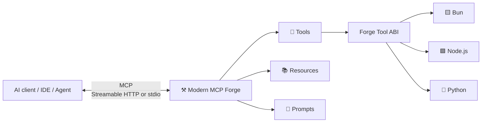

<div align="center">

# ⚒️ Modern MCP Forge

### Build, test, and run MCP servers visually — without locking your tools to one language.

[](https://github.com/ModernSoftware/modern-mcp-forge/actions/workflows/ci.yml)
[](https://github.com/ModernSoftware/modern-mcp-forge/actions/workflows/docker.yml)
[](https://github.com/ModernSoftware/modern-mcp-forge/pkgs/container/modern-mcp-forge)
[](LICENSE)


**Local-first · Multi-project · Language-neutral · Git-friendly**

</div>

> [!NOTE]
> Modern MCP Forge **0.9.0** is the first public beta. Feedback, bug reports,
> ideas, and contributions are welcome as the project moves toward 1.0.

Modern MCP Forge is a local-first visual workbench for authoring and testing
[Model Context Protocol](https://modelcontextprotocol.io/) servers. It keeps the
MCP boundary standard while letting Tool implementations run through a small,
language-neutral Forge Tool ABI.

The result is a developer environment where MCP Tools, Resources, and Prompts
can be managed visually without requiring every Tool to be implemented in the
same runtime.

## ✨ Highlights

| | Capability |
| --- | --- |
| 🗂️ | **Multi-project workspace** with portable, Git-friendly `forge.project.json` manifests |
| 🧰 | **Visual authoring** for MCP Tools, Resources, and Prompts |
| 🟨 | **Bun Tool execution** through the Forge Tool ABI |
| 🟩 | **Node.js Tool execution** using the same ABI |
| 🐍 | **Python Tool execution** using the same ABI |
| 🧠 | **Monaco-powered editing** for Tool source, Resources, Prompts, and advanced JSON Schema |
| 🧪 | **Execution history and diagnostics** stored locally in SQLite |
| 🌐 | **Streamable HTTP MCP transport** at `/mcp` |
| 🖥️ | **stdio MCP transport** with explicit project selection |
| 🌗 | **Light and dark themes** with a local-first desktop-style workflow |
| ✅ | **Automated verification** across Windows, macOS, and Linux |

## 🧭 How it fits together



Forge speaks standard MCP externally. The Forge Tool ABI is an internal
execution boundary that allows Tool implementations to remain
runtime-independent.

## 🚀 Quick start

### Requirements

- [Bun](https://bun.sh/) — required
- Node.js — optional, for Node Tools
- Python — optional, for Python Tools

Install dependencies:

```bash
bun install
```

Run the development server:

```bash
bun run dev
```

Then open the local URL shown by Vite and create or open a Forge project.

Run the complete local release gate:

```bash
bun run test:all
```

### 🐳 Docker

Docker is also available as an optional distribution:

```bash
docker pull ghcr.io/modernsoftware/modern-mcp-forge:edge
```

For a persistent setup with host project folders mounted into Forge, use the
included `compose.yaml`. See the [Docker guide](docs/docker.md).

## 📦 Project model

A Forge project is intentionally portable:

```text
my-mcp-project/
├── forge.project.json
├── tools/
├── resources/
└── prompts/
```

The project directory is the source of truth and can be committed directly to
Git.

Machine-local state such as recent projects and execution history is kept
outside the project in the user's application-data directory.

## 🔌 MCP transports

### 🌐 Streamable HTTP

With Forge running and a project open:

```text
http://localhost:5173/mcp
```

Smoke test:

```bash
bun run mcp:smoke
```

### 🖥️ stdio

stdio launches Forge for one explicit project and does not depend on whichever
project is open in the web UI:

```bash
bun run scripts/mcp-stdio.ts --project /path/to/forge-project
```

Smoke test:

```bash
bun run mcp:stdio:smoke -- --project /path/to/forge-project
```

This makes it suitable for MCP hosts that spawn local servers as child
processes.

## 🧪 Quality and testing

Modern MCP Forge is tested at several levels:

```text
Unit tests
    ↓
Integration tests
    ↓
HTTP + stdio MCP end-to-end tests
    ↓
Production build
    ↓
Windows + macOS + Linux GitHub Actions
```

Useful commands:

```bash
bun run check
bun run test:unit
bun run test:integration
bun run test:e2e
bun run test:coverage
bun run build
bun run test:all
```

The GitHub Actions workflow runs the verification suite on all three supported
desktop operating-system families.

## 📚 Documentation

- 🗃️ [Application data](docs/app-data.md)
- 🐳 [Docker and GHCR](docs/docker.md)
- 🖥️ [MCP stdio transport](docs/mcp-stdio.md)
- 🧪 [Testing](docs/testing.md)
- 🔄 [Continuous integration](docs/ci.md)
- ✅ [0.9.0 release checklist](docs/release-checklist.md)
- 🤖 [Agent example](examples/agent/README.md)
- 📖 [Documentation index](docs/README.md)

Additional documentation for architecture, the Tool ABI, security,
troubleshooting, and contribution guidance will continue to grow during the
public beta.

## 🔐 Security note

> [!WARNING]
> Modern MCP Forge executes Tool code from the project you open. Treat an
> untrusted Forge project the same way you would treat any other untrusted
> source-code repository.

Local management endpoints are intentionally restricted to loopback traffic,
and stdio reserves stdout exclusively for MCP protocol messages.

## 🤝 Contributors

Contributions, bug reports, ideas, and feedback are welcome.

<a href="https://github.com/ModernSoftware/modern-mcp-forge/graphs/contributors">
  
</a>

See the [contributors graph](https://github.com/ModernSoftware/modern-mcp-forge/graphs/contributors)
or open an [issue](https://github.com/ModernSoftware/modern-mcp-forge/issues).

## 📄 License

Modern MCP Forge is licensed under the
[Apache License 2.0](LICENSE).

Apache-2.0 is a permissive open-source license that allows commercial use,
modification, and distribution while also providing an explicit patent grant.

---

<div align="center">

**Built by [Modern Software](https://github.com/ModernSoftware)**

If Modern MCP Forge is useful to you, consider starring the repository and
sharing feedback during the 0.9 public beta.

</div>

## v0.10.0 native MCPack preview

Open, edit, restart, and test native MCPack projects with the same files used for standalone deployment. See [the setup and integration guide](docs/mcpack.md). MCPack can be installed locally from its private checkout; no package publication is required.
